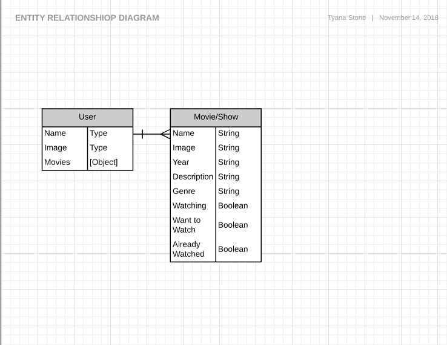
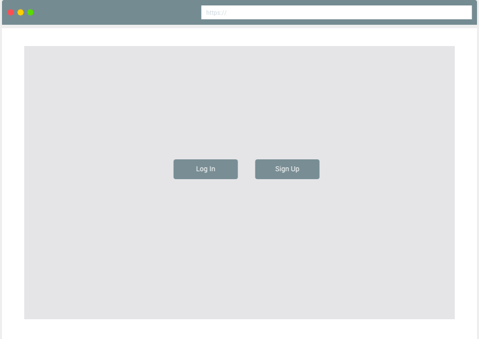
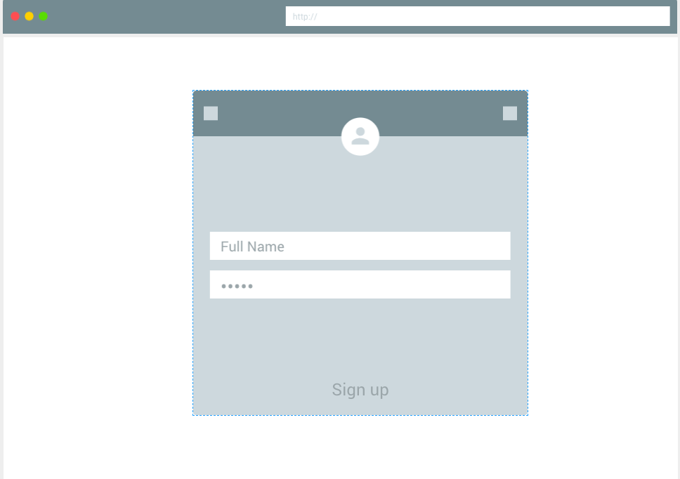
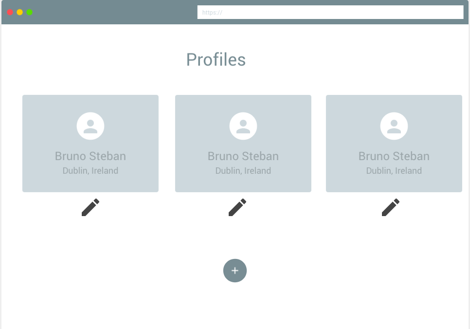
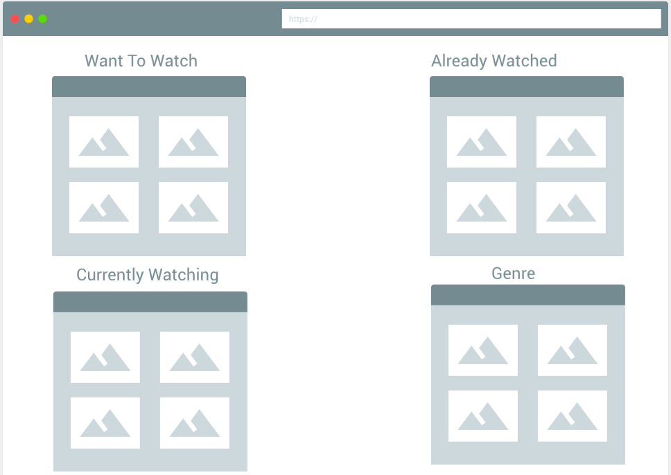
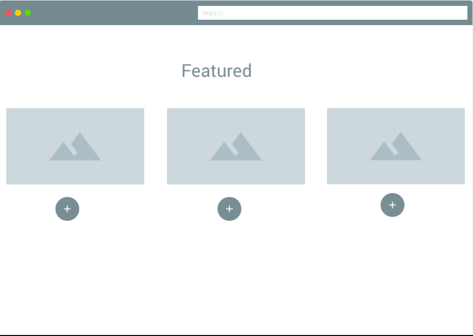
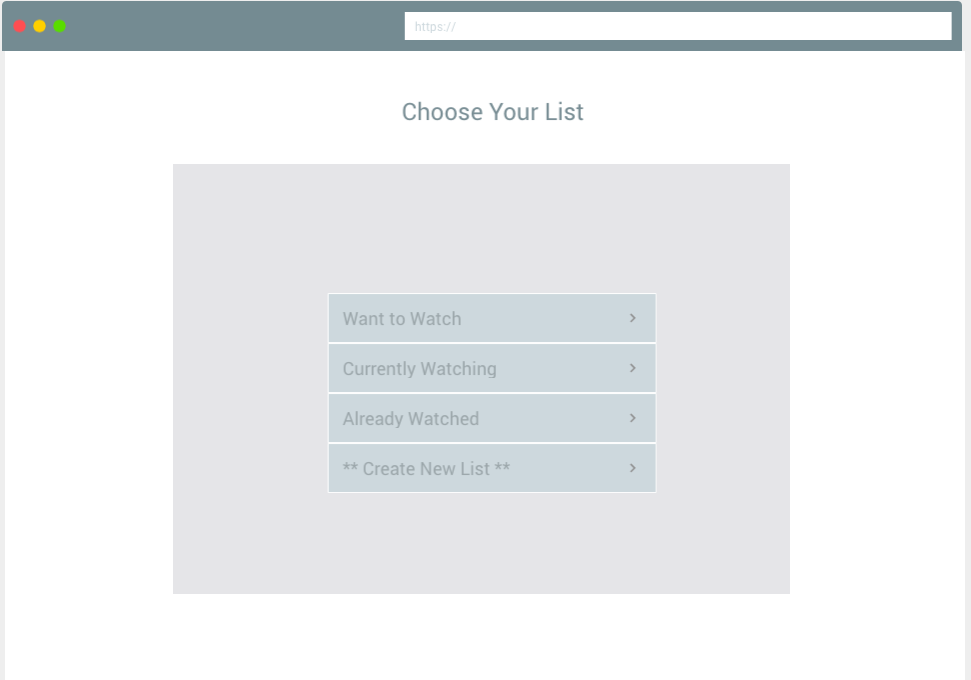
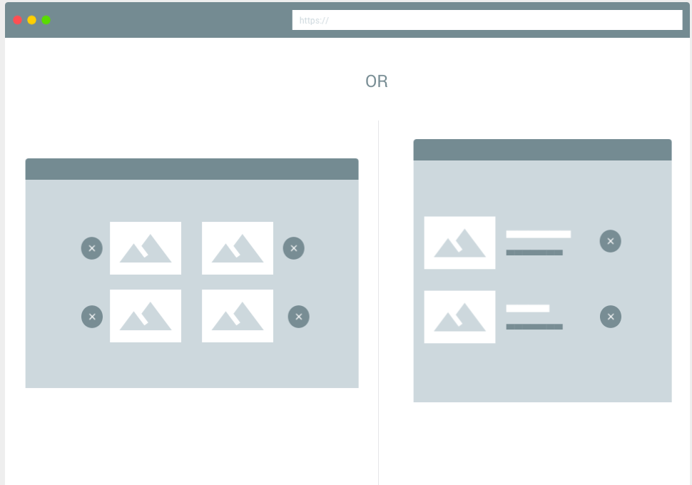
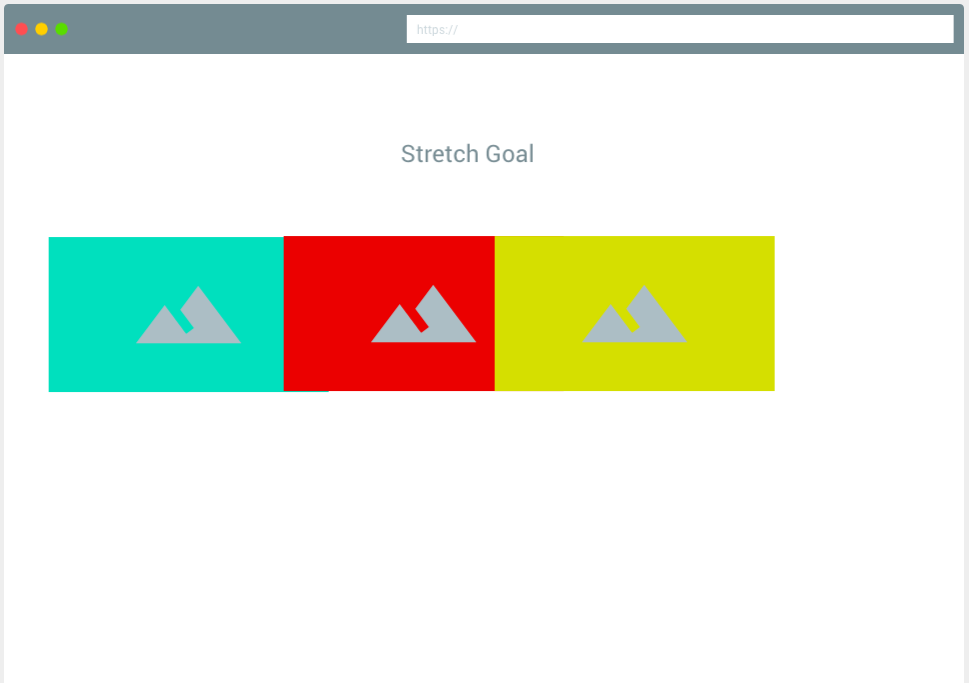

# Binger.io

#### Project Description

[Click Here for Assignment Page](https://git.generalassemb.ly/atl-wdi/project-03-react)

 #### Entity Relationship Diagram

#### Wireframe

#### Trello
 [Click Here For Trello](https://trello.com/b/2gHIVhYz/bingerio)

#### Libraries Used
 | Library | Link |
| --- | --- |
| Frame Work | [ReactStrap](https://github.com/reactstrap/reactstrap) |
| Web Designer | [Web Designer](https://www.myfavouritemagazines.co.uk/design/web-designer-magazine-subscription/) |
| Fonts | [Google Fonts](https://fonts.google.com/) |

#### Wishes & Dreams

- I wanted to be able to add movies to a list so that when you click on the add button the movie would then generate into your list onto a seperate page. 
- I wanted to be able to create new lists. 

#### Web Application
[Click Here For Site](https://movie-binge.herokuapp.com/)

