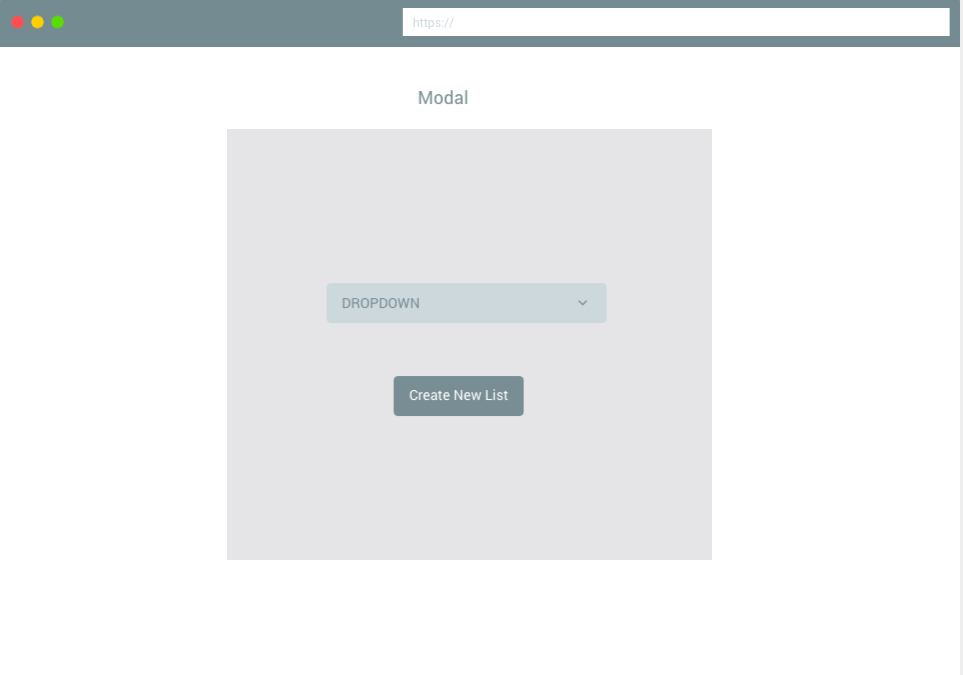

# Binger.io

Do you like to binge watch movies and tv shows and would like a way to keep up with all the films and tv shows you've watched or would like to watch?! Well no need to look any further Binger.io is here! Binger.io was created as a list app to keep track of movies/shows you want to watch, currently watching or already watched. I came up with this idea because normally I keep a "mental list" of everything in my head, but with words of wisdom from two of my classmates, I learned that I need to get things "out of my head"; and from there generated the idea of Binger.io!

#### Project Description

[Click Here for Assignment Page](https://git.generalassemb.ly/atl-wdi/project-03-react)

 #### Entity Relationship Diagram

#### Wireframe

#### Trello
 [Click Here For Trello](https://trello.com/b/2gHIVhYz/bingerio)

#### Libraries Used
 | Library | Link |
| --- | --- |
| Frame Work | [ReactStrap](https://github.com/reactstrap/reactstrap) |
| Web Designer | [Web Designer](https://www.myfavouritemagazines.co.uk/design/web-designer-magazine-subscription/) |
| Fonts | [Google Fonts](https://fonts.google.com/) |

#### Wishes & Dreams

- I wanted to be able to add movies to a list so that when you click on the add button the movie would then generate into your list onto a seperate page. 
- I wanted to be able to create new lists. 

#### Web Application
[Click Here For Site](https://movie-binge.herokuapp.com/)

